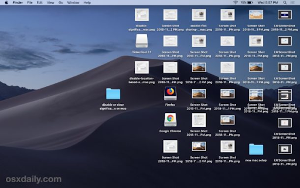

# What is the command line?

<iframe width="560" height="315" src="https://www.youtube.com/embed/h4nQ6uoegOc" title="YouTube video player" frameborder="0" allow="accelerometer; autoplay; clipboard-write; encrypted-media; gyroscope; picture-in-picture; web-share" allowfullscreen></iframe>

The command line is an interface that allows you to directly interact with your computer without regard to the graphical user interface or GUI. The GUI is what you see as soon as you open your computer such as the image of your desktop. See below for example



* The command line allows you to bypass the use of the point-and-click operations you would normally use to interact with your computer.
* The basic computer language you use to interact with your computer via a linux terminal is called "BASH", which stands for Bourne-Again SHell (this is certainly not important!). 

### How you access your command line?

* On a Mac you can simply open the, “Terminal” application

* On windows you will likely have to open “Windows terminal”---instructions on how to install and get started with “Windows Terminal” can be found [here](https://docs.microsoft.com/en-us/windows/terminal/install)
** From there you will also need to install a Linux subdistribution such as Ubuntu— You can find instructions on how to install this subsystem [here](https://docs.microsoft.com/en-us/windows/wsl/about)

# What do you use the command line for?

* The command line can be a helpful tool for doing basic programming tasks.

* Say you want to simply navigate around your computer without using the GUI, instead, you can do simple things like the following. Navigating to your computer’s desktop


Give the following a try in a terminal.
```
(HINT!) when you see the hash or pound sign (#) this means the text to the right is a comment and does not get executed by the interpreter or the command line.

cd Users/<name>/Desktop/ # this bit of code will take you to your desktop

ls  # is a command that will allow you to list all the files in the current location (the desktop).

scp  # using “scp” will allow you to make copies of files and put them wherever you want on your computer
```
** If you want to learn more about commenting code in different languages see [here](https://geekflare.com/how-to-add-comments/)

While your ability to use the command line will not be tested directly in this course, having an understanding and appreciation of what the command line can do / what Bash can do as a computer language will give you some more flexibility in your workflow in the future. 


### [Home](https://bdeck8317.github.io/compPsy.github.io/)
