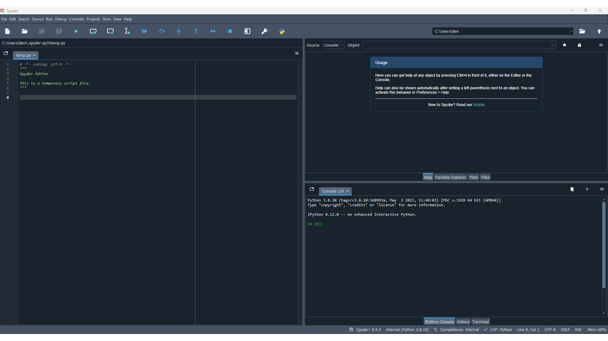
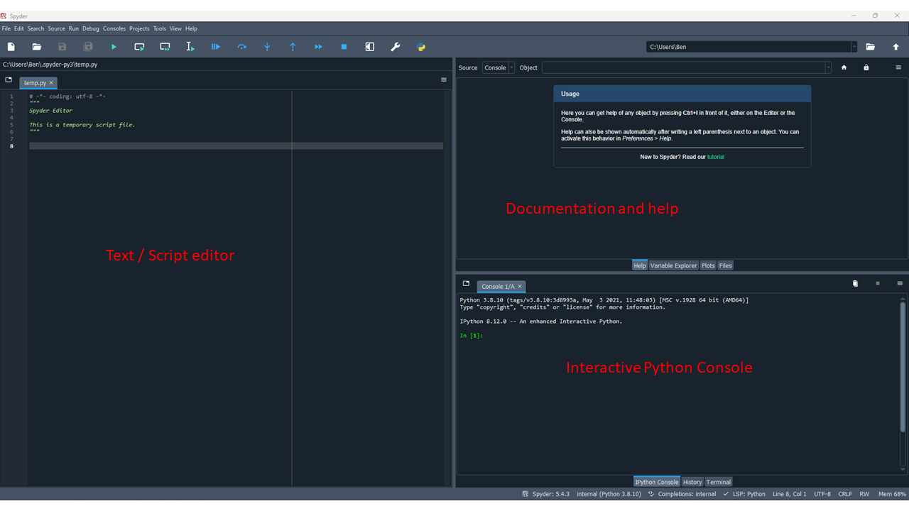

# Introduction to Python and Jupyter Lab

## Lesson Objectives
* Get familiar with Python and Spyder including the Markdown info
* What is a variable?
* Creating your first script and “Hello, World!”

## Opening Spyder

In order to open Spyder, first load Anaconda navigator and click "Launch" under Spyder


## Getting to know Jupyter Lab and Python

Once Spyder opens you should see an image like the one provided below:





## Getting to know the Spyder interface




* Documentation and help: This is where you can navigate to function documentation, explor variables from your scripts, navigate to different files on your computer or examine plots you have created..

* Script editor/ terminal: Much like R and Rstudio, Spyder and Python work similarly in that you can edit and execute code all within the same environment.

* Interactive Python console: Here you can test your commands and statements interactively to examine their functionality.

## Let’s save a script in the same folder as your project from R and Rstudio

Let's save this in the same folder as your R project that you previously created. Call the file ```hello_world.py```

## Creating your first python script
* For this script, you should enter the following into the first line.

```python
# Here we are assigning variables, unlike R, 
# python uses only the = as variable assignment key. 

x = 10
y = 13

print(x)
print(y)
```

Now click the "Run File" button on the top panel or press F5 on your keyboard to execute the current script.


* This will execute your code and print the values of x and y

Like R, when you then print that variable to the console, the computer has to look for the value that corresponds to the variable in its saved memory.

You can also assign text to variables (these are called strings). You will learn much more about strings and how R interacts with them in the next few lessons.

You can also re-assign variables just like in R

```python
# The print command allows you to print the values of x 
# and y to the user (in this case, you).
# You can also assign new values to old variables 
# (typically not recommended as this can get confusing quickly).

x = 17
y = 20

print(x)
print(y)
```
Lets make a loop and print some text a few times!

```python
my_text = 'hello, world!'

for ii in range(3):
    print(my_text)

# In this little script there are actually a number of things happening. 
# We will talk more about each of these steps when we talk about information flow. 
# But it's good to see this kind of code early and often.

# Briefly, we assign 'hello, world!' to my_text variable. 
# Then we use what is called an iterator and a for loop to loop over a range of iterators 3 i.e.
# you can read this as "1 to 3" and then it simply prints my_text the number of times the loop iterates. 
# In this case, it will print the contents of my_text 3 times. 
```

* Now press save or ctrl/command+s and you're done!


### [Home](https://bdeck8317.github.io/compPsy.github.io/)
