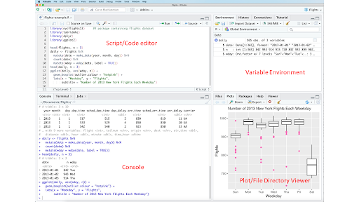
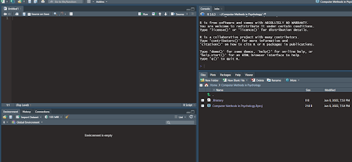

# Introduction to R and RStudio
## Lesson Objectives
* Get familiar with R and Rstudio, including the GUI
* Let’s make a class “Project”
* What is a variable?
* Creating your first script and “Hello, World!”
* Don’t be afraid, you will not break your computer with code!

## Opening RStudio and getting familiar with the GUI
In order to open RStudio and interact with it, you must simply open Rstudio like you would any other software. 
Upon opening Rstudio you should see the following:

* Script/Code Editor: This is where you can write savable code, including variable assignment/ plot creation etc.

* Console: This region is where the code from your script editor actually gets executed. This area is not saved. You can also use this region to test bits of code out before you save them in the code editor.

* Variable environment: This region allows you to see the variables/objects/data you save into the computer’s memory for later use.

* Plot/File Directory Viewer: If you call a plot in the console or the script region, your plot will appear in this location. Additionally, this location is a quick way to view your computer’s file structure and is equivalent to Windows Explorer or Mac’s Finder dialog boxes.

Feel free to customize the colors and the location of these panels. Many people make their GUI representative of what they prefer when looking at their computer screen, including dark mode, which can be easier on your eyes.



You will get more familiar with the GUI of Rstudio throughout this course, but that should be enough to get you started.


## Let's Make a class project

One thing that you should get into the habit of is creating projects in Rstudio. 

Why might you want to do this? 
1. For a truly in-depth discussion on this topic, see [here](https://r4ds.had.co.nz/workflow-projects.html)----One reason is package versioning is preserved in a project. Creating a project helps you to organize all of your code into a directory
* To create a new project, select “File → New project”
* From here on, we will save all your R files to this project.

## Let's create our first script in R
For this script, you should enter the following into the Console.
```R
# Here we are assigning variables, you can use either method, but the accepted method in R is to use y <- 13 —a shortcut for this symbol can be used by concurrently pressing the “alt” and “-” symbols (no quotes needed).

x = 10
y <- 13

print(x)
print(y)

# The print command allows you to print the values of x and y to the user (in this case, you).
You can also assign new values to old variables (typically not recommended as this can get confusing quickly).

x <- 17
y <- 20

print(x)
print(y)
```
Take a look at the output of our print statements. You should notice that x and y are now assigned to the values. This concept is the same as you would see in a mathematical formula. However, in this case, you are actually storing the value and the bytes of information that value consumes into your computer’s memory.

When you print a variable to the console, the computer has to look for the value corresponding to the variable in its saved memory.

You can also assign text to variables (these are called strings). You will learn much more about strings and how R interacts with them in the next few lessons.

In the following code block, I would like you to type this into your “Script/ Code Editor”
* This is where you can save your code for the next time you want to run it.

```R
my_text <- 'hello, world!'

for (ii in 1:3){
  print(my_text)
}

# In this little script there are actually a number of things happening. We will talk more about each of these steps when we talk about information flow. But it's good to see this kind of code early and often.

# Briefly, we assign 'hello, world!' to my_text variable. Then we use what is called an iterator and a for loop to loop over a range of iterators 1:3 i.e. you can read this as "1 to 3" and then it simply prints my_text the number of times the loop iterates. In this case, it will print the contents of my_text 3 times. 
```

To run code in an R script, you can either highlight it and press “Control” and “Enter” concurrently or you can run the entire script with the “Source” Button located in the top right of the code editor.


After you finish, with the above code block, go ahead and save this little script and call it my_world_script. Make sure you save this under the project you just created


That’s it, this lesson is over. You just created your first-ever script. Don’t worry if it wasn’t that exciting, it will become much more interesting as you start your own adventures. 

Keep this in mind, you won’t break your computer, try things in your code, the worst that happens is that it throws an error, and you have to debug it. That is the quickest way to learn. 


### [Home](https://bdeck8317.github.io/compPsy.github.io/)
