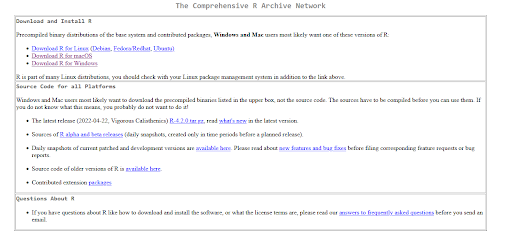
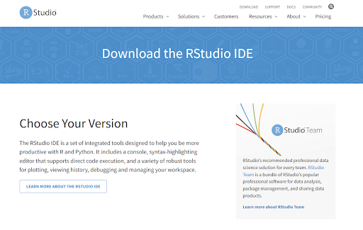

# Getting started: configuring your computer to run R/Rstudio, python/Jupyter Lab, and Matlab

## R and Rstudio
Unlike many other types of software, you may have installed previously, R and Rstudio work together to bring you one coherent experience. 
The way I like to think about this is that R is the airplane and Rstudio is the run-way / airport.

R is simply a language like many other computer languages, such as C, C #, C++, and python, just to name a few. 

Rstudio is an integrated development environment or IDE for short. There are many IDEs you can download and play around with. However, in R, the most widely used is Rstudio. 

## Downloading R
To get started please follow the link [here](https://cran.r-project.org/)

*You should see this page

*Once you have navigated to this page, click “Download R for ….”
** Select whichever OS you are currently running.

* The following page regardless of OS will bring you to links to install the R distribution.
** You should download the “latest” version of R. —Depending on your computer specifications.

* After you download R it will start an installation wizard which will assist you in completing your installation

## Downloading RStudio
Like the analogy mentioned before. We have created the airplane which will do all of the work. Now we need to create the airport, including your favorite coffee shops… we’ll show you more about determining if you want cold brew or iced coffee later when we talk about setting up the aesthetics of Rstudio.

* To download R click [here](https://www.rstudio.com/products/rstudio/download/)

*You should see the following page:

*Scroll down to the “Free installation” and click download.

**A second page will appear. Likely the website will automatically detect your OS and will suggest the download package you should select. If for some reason it suggests the incorrect OS, no worries. Just scroll down to the OS that corresponds with your computer and click “Download”

* After Rstudio has finished downloading, you’re ready to get going with R and Rstudio. 

## Python and Jupyter Lab

Similar to R and Rstudio, python is a basic computer language that actually has an amusing backstory 

Because of the open-source ubiquity of python in data science and statistics, including industry and academia, using python has become much easier than installing multiple dependencies etc.

For this course the only thing you need to install is called, “Anaconda”. Anaconda is a distribution that is packed with lots of packages that will be helpful to you in running python including jupyter and jupyter lab (python’s popular IDE and visualization software).

## Installing Anaconda
Go to the following [page](https://www.anaconda.com/)

* Like RStudio, anaconda’s webpage will automatically determine your OS. If it is incorrect below the download button is the graphical representation of the other possible OS installations.

** Follow the directions on this [page](https://problemsolvingwithpython.com/01-Orientation/01.03-Installing-Anaconda-on-Windows/) for Windows OS and this [page](https://problemsolvingwithpython.com/01-Orientation/01.04-Installing-Anaconda-on-MacOS/) for Mac OS to ensure that python and anaconda have been properly installed on your computer

And that’s it. You are now ready to start working with both python and R. Let the games begin!

### [Home](https://bdeck8317.github.io/compPsy.github.io/)
