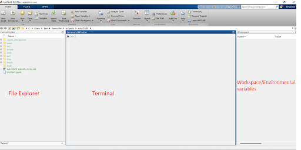
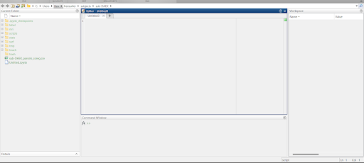

# Introduction to Matlab

## Lesson Objectives
* Get familiar with Matlab and scripting
* What is a variable?
* Creating your first script, Hello,World!

## Opening Matlab
Thankfully, opening Matlab is very simple. It opens like any other software, by clicking on the Matlab icon either on your desktop or in the respective directory where matlab is installed (i.e., Applications, etc.).

* In some cases you may need to start Matlab as an administrator using the terminal. If matlab is installed properly, you should be able to open a terminal and type: 
```
matlab
```
* Matlab should take only a moment and then it will open

## Once matlab is opened you hsould see the following window



* File Explorer: This space allows you to navigate to folders and files located on your personal computer.

* Terminal: The terminal, like in python and R allows you to directly interact with Matlab and test your code before you add it to your script or code block. 

* Workspace/ Environmental Variables: This is similar to R’s global environment region in RStudio. Here you can see the variable that have been assigned and their datatype/structure. These variable are loaded into your computer’s ram. You will notice that the more variables you have loaded into your local environment, the slower your computer will operate. We will discuss this idea further in the advanced topics section later in the course.

## Creating your first script in Matlab

In the upper left-hand corner of your Matlab window you will see, “New Script”. Click this icon and it will open a new blank script document. 

* You will want to save this in a dedicated folder you did for the R project and python markdown document that you previously created.

* Your Matlab window should now look like this, with four independent sections on the screen:



* The new window is your script editor, where like R and python, you can save your code for later use. 

* Go ahead and create some variables.

```
% Here we are assigning variable, similar to python, Matlab uses only the = as variable assignment key. 

x = 10
y = 13

disp(x) % Unlike R and python, Matlab uses a slightly different function to display the output of a variable, in this case the function is called “disp”.  
disp(y)

```

In order to execute the code you must save and then click “Run” at the top of the Matlab toolbar. 
* The code should print to the terminal and you will now have new environmental varaibles saved in memory. 

* Like R and python, you can also re-assign these variable to new values and variables can also contain strings.

## Hello, World! Matlab version

```
x = 'Hello, World!'


for ii = 1:5
    disp(x)
end

% You will notice slight differences in syntax between R, python, and Matlab. Don’t be startled by this. Most of the syntax differences are simple to solve if you get hung up on them. However, the general premise of coding is reinforced by learning multiple languages. By doing so, you will learn that programming is mostly the same regardless the language you are using.

% In this bit of code you will notice that we initiate our x-variable as a string and then open our for-loop, just like in R and python. In this case, we initiate ii as the iterator and then have it iterate starting at 1 and then continuing on to 5 loops. Therefore, the output should display the x variable’s values 5 times to the terminal. If you save and run this script, you will notice that this is indeed what this code will do.

```
Now save your code and you will be able to return to this bit of code when you want to in the future.


That’s it for this lesson!

