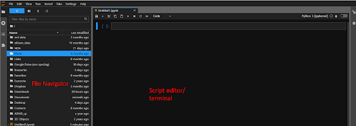

# Introduction to Python and Jupyter Lab

## Lesson Objectives
* Get familiar with Python and Jupyterlab including the Markdown info
* What is a variable?
* Creating your first script and “Hello, World!”

## Opening Jupyter Lab

Unfortunately opening jupyter lab is a little more complicated than Rstudio. Don’t fret it’s still not too bad.

* On Mac and Linux operating systems you can simply open “Terminal” and type ```jupyter lab```

* On Windows you will need to open “Anaconda Terminal”

* You may need to change your directory to your home directory. You can do so with the following commands:
```
cd \Users\<yourusername>\
```
* After this opens, you need to type ```jupyter lab```
* After you press enter, your web browser should automatically open.

## Getting to know Jupyter Lab and Python

Your web browser should have automatically opened, upon pressing enter on the last step. 

Jupyter lab is run through your web browser on what is called a local host. This means only you can see this page and it is a one way communication to your computer. Don’t worry, you aren’t making a website for the world to see.

Jupyter lab should open and look like this.


* Now select “Python 3 (pykernel) under the “Notebook” header. This will create a python kernel, a way your computer interacts with python through the web browser. Don’t worry about the specifics of how this works. If you want to learn more, see [here](https://docs.jupyter.org/en/latest/projects/architecture/content-architecture.html).
* This will open a new jupyter notebook. This is an interactive console similar to an R markdown notebook (you will learn more about these notebooks as the course progresses and you become more comfortable interacting with them).
* This type of interactive way of coding in python allows you to quickly get feedback about your code, similar to the terminal on your computer. However, your computer terminal doesn’t necessarily allow you to create graphs, etc.

## Getting to know your Jupyter Lab interface

Your screen should look something like the one above

* File navigator: This is where you can navigate to folders and open files.

* Script editor/ terminal: Much like R and Rstudio, Jupyter notebooks and python work similarly in that you can edit and execute code all within the same environment. In this case, python and Jupyter notebooks allow you to immediately run and see the output (or another name for this is “standard out”) after executing the code.

* You may notice that my jupyter nodebook/ lab is dark. You can easily change this with the following process: Settings → Jupyter Lab Themes. You can also select your text editor themes as well by selecting: Settings → Text Editor Theme—This changes the colors of your text. 

* You will get more familiar with the GUI of Jupyter Notebooks and Jupyter Lab throughout this course, but that should be enough to get you started.

## Let’s save your notebook in the same folder as your project from R and Rstudio

* You can close the current notebook and, on the left-hand pane (your file navigator), navigate to the folder that is above your R and Rstudio project for this course

* Then open a new notebook. Your navigator should look like this:

* You can then change the name of this "Untitled.ipynb" (the extension .ipynb stands for interactive python notebook). Simply right-click and select “Rename”. Then type ```hello_world```

## Creating your first python script
* For this script, you should enter the following into the first line.

```
# Here we are assigning variables, unlike R, python uses only the = as variable assignment key. 

x = 10
y = 13

print(x)
print(y)
```

* Once you type the above into the first line (you can hit enter so not everything is on one line) you may notice that pressing enter doesn’t execute the code!


* No worries! — simply press “Shift” and “Enter” concurrently.

* This will execute your code and print the values of x and y

Like R, when you then print that variable to the console, the computer has to look for the value that corresponds to the variable in its saved memory.

You can also assign text to variables (these are called strings). You will learn much more about strings and how R interacts with them in the next few lessons.

You can also re-assign variables just like in R
```
# The print command allows you to print the values of x and y to the user (in this case, you).
# You can also assign new values to old variables (typically not recommended as this can get confusing quickly).

x = 17
y = 20

print(x)
print(y)
```
Lets make a loop and print some text a few times!

```
my_text = 'hello, world!'

for ii in range(3):
    print(my_text)

# In this little script there are actually a number of things happening. We will talk more about each of these steps when we talk about information flow. But it's good to see this kind of code early and often.

# Briefly, we assign 'hello, world!' to my_text variable. Then we use what is called an iterator and a for loop to loop over a range of iterators 3 i.e. you can read this as "1 to 3" and then it simply prints my_text the number of times the loop iterates. In this case, it will print the contents of my_text 3 times. 
```

## Why Markdown?
One of the fun and powerful things about using a Markdown document is that you can print regular text as well.

You can add markdown text which is a way to describe what the output of your code is to others.

Below your code do the following: At the top of the page you will see the following buttons: 


* Select the “Code” dropdown. 
* Then select “Markdown”

* Your line editor will look like this:


* Now type the following: “My for loop which iterates and prints hello, world 3 times!”---then execute the code.

* The output should look like this 


You may notice that you can put anything in this box and execute it. Python and the jupyter notebook assume this is just text and not code to execute. So it just saves that text within the notebook and moves to the next line of executable code. You can tell that it’s executable by the [ ]: which will be filled by the code line number upon the next execution.


* Now press save or ctrl/command+s and you're done!


